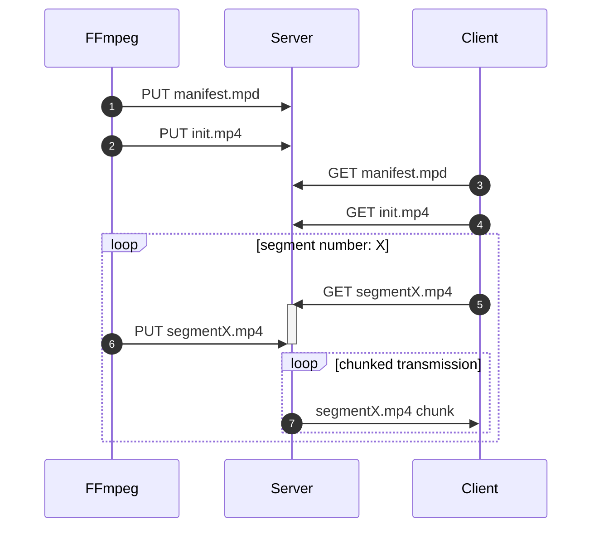

# Fast-ll

Fast-ll is a LL-DASH web server. It handles segment PUT and GET request so request can arrive even
before the actual segment has arrived. Then, it uses HTTP chunked transfer to server segments as
they arrive.

## Fast-ll request diagram


```mermaid
sequenceDiagram
    autonumber
    participant FFmpeg
    participant Server
    participant Client
    FFmpeg->>Server: PUT manifest.mpd
    FFmpeg->>Server: PUT init.mp4
      Client->>Server: GET manifest.mpd
    Client->>Server: GET init.mp4
    loop segment number: X
        Client->>Server: GET segmentX.mp4
        activate Server

        FFmpeg->>Server: PUT segmentX.mp4
        deactivate Server
        loop chunked transmission
            Server->>Client: segmentX.mp4 chunk
        end
    end

```

## Run Fast-ll
We recommend using Python's virtual environment to use Fast-ll.
To create one jun run this inside your project's folder:
```bash
python3 -m venv venv
```
After that, and every time you want to run Fast-ll, activate the virtual environment:
```bash
source venv/bin/activate
```
With the virtual environment activate
```bash
pip install -r requirements.txt
```
Finally, simply run:
```bash
uvicorn fastll:app
```

## Run generated video source
Fast-ll needs a video source to feed the service. To create a test one, run the
`gen-video.sh` shell script.

## Media playback
In order to play the media content you can use any player you want. For reference, you
can try [Dash.js](https://reference.dashif.org/dash.js/).
Configure it as wanted and use the URL of the manifest in Fast-ll. It is always a good
idea to check the availability of the manifest with a regular web browser.