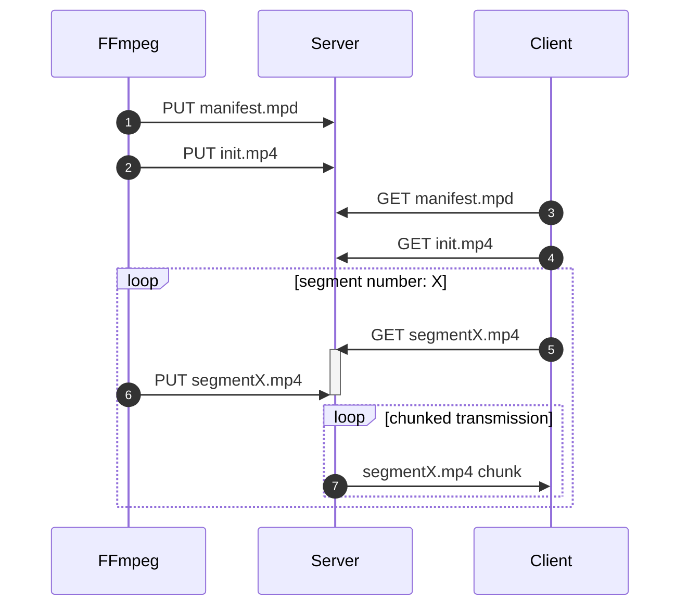

# Fast-ll

Fast-ll is a LL-DASH web server. It handles segment PUT and GET request so request can arrive even
before the actual segment has arrived. Then, it uses HTTP chunked transfer to server segments as
they arrive.

## Fast-ll request diagram

```mermaid
sequenceDiagram
    autonumber
    participant FFmpeg
    participant Server
    participant Client
    FFmpeg->>Server: PUT manifest.mpd
    FFmpeg->>Server: PUT init.mp4
      Client->>Server: GET manifest.mpd
    Client->>Server: GET init.mp4
    loop segment number: X
        Client->>Server: GET segmentX.mp4
        activate Server

        FFmpeg->>Server: PUT segmentX.mp4
        deactivate Server
        loop chunked transmission
            Server->>Client: segmentX.mp4 chunk
        end
    end

```